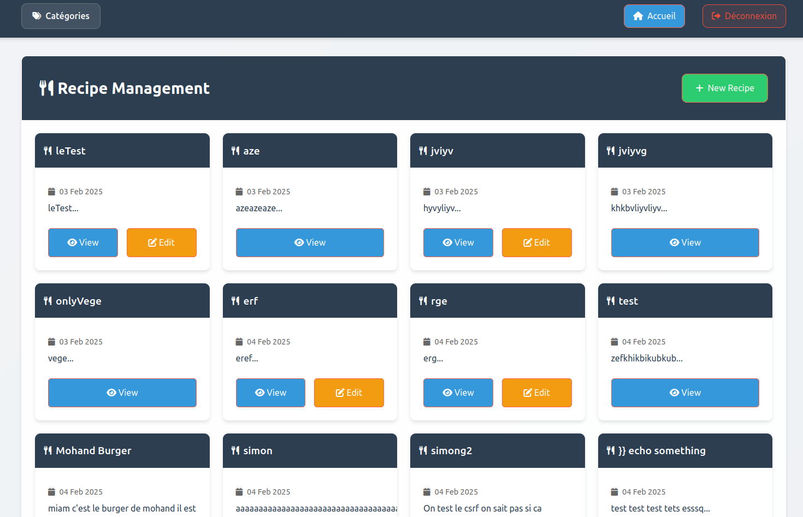

<h1>🍽️ Projet Recettes</h1>

Une application web de gestion de recettes développée avec Symfony. Elle permet aux utilisateurs d'ajouter, modifier et consulter des recettes facilement.

<h2>🛠 Technologies utilisées</h2>
<ul>
    <li><strong>PHP</strong> : Langage backend</li>
    <li><strong>Symfony</strong> : Framework MVC pour une architecture robuste</li>
    <li><strong>Twig</strong> : Moteur de templates pour des vues dynamiques</li>
    <li><strong>JavaScript</strong> : Interactivité côté client</li>
    <li><strong>CSS</strong> : Mise en page et styles</li>
</ul>

<h2>🍳 Fonctionnalités</h2>
<ul>
    <li>Ajout, modification et suppression de recettes 📋</li>
    <li>Affichage dynamique avec Twig et JavaScript ⚡</li>
    <li>Design responsive pour une expérience fluide 📱💻</li>
</ul>

<h2>📷 Aperçu</h2>
</img>
